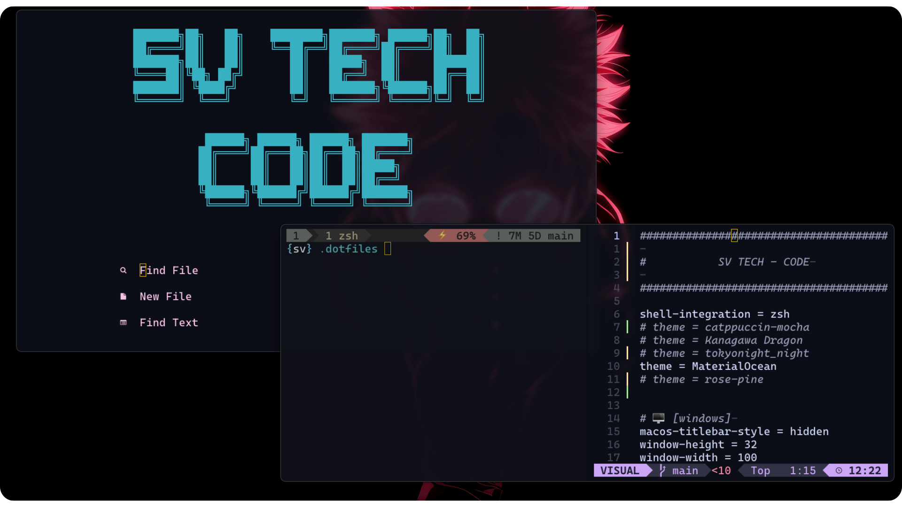

# .dotfiles

A continuación, encontrarás mi *.dotfiles* con las configuraciones de mi entorno de trabajo en MacOS. También podrás revisar para cada configuración los requerimientos y las webs oficiales para poder revisar la documentación de cada configuración.

<div align="center">
  <a href="https://www.linkedin.com/in/mario-sandoval-luengo-a059051b6" target="_blank" >
    </a>
  &nbsp;
  <a href="https://www.instagram.com/svtech_code/" target="_blank" >
    </a>
  &nbsp;
  <a href="https://x.com/svtech_code" target="_blank" >
    </a>
</div>




## Recomendaciones
### Homebrew
Para la instalación de componentes, dependencias e incluso aplicaciones, yo utilizo [Homebrew](https://brew.sh), con el cual, puedes instalar casi todo lo que necesitas para poder utilizar las configuraciones que tienes en mi *.dotfiles*.
Del mismo modo, en su página puedes buscar el complemento/aplicación que necesitas instalar y podrás ver si está disponible, junto con el código de instalación😎.

### Fuentes nerd fonts
Instalando las fuentes [nerd fonts](https://www.nerdfonts.com), podrás disfrutar de la visualización de iconos y formas, que con las fuentes normales, no es posible. Estas fuentes las puedes instalada desde su web oficial, o directamente haciendo uso de brew, tal como se muestra en el ejemplo a continuación:
```
brew install --cask font-hack-nerd-font
```

<br><br>


## Configuraciones de mi espacio de trabajo
A continuación, tienes el acceso hacia las configuraciones de cada una de las herramientas que utilizo actualmente para mi entorno de trabajo, en donde, encontrarás como instalarlas e implementarlas, para un entorno de trabajo en macOS.

- [ghossty](https://github.com/svtech-code/.dotfiles/tree/main/ghostty) - Mi nuevo emulador de terminal, rápido y minimalista.
- [zsh](https://github.com/svtech-code/.dotfiles/tree/main/zsh) - Una shell que puede ser personalizada mediante configuraciones y complementos.
- [nvim](https://github.com/svtech-code/.dotfiles/tree/main/nvim) - Un editor de texto poderoso para programar.
- [tmux](https://github.com/svtech-code/.dotfiles/tree/main/tmux) - Un multiplexor para trabajar con diferentes pantallas en un mismo entorno.

<br><br>

## Herramientas de trabajo
Por último, a continuación podrás revisar las herramientas que he probado, para que puedas revisar su web y comprobar si alguna de estas llama tu atención.

### Emuladores de terminal
- [Ghostty](https://ghostty.org)
- [Alacritty](https://alacritty.org)
- [Warp](https://www.warp.dev/e)
- [Iterm 2](https://iterm2.com)
- [WezTerm](https://wezfurlong.org/wezterm/index.html)
- [Kitty](https://sw.kovidgoyal.net/kitty/)

### Multiplexores
- [Tmux](https://github.com/tmux/tmux/wiki)
- [Zellij](https://zellij.dev)

### Editores, shells y complementos
- [Nvim](https://neovim.io)
- [zsh](https://github.com/ohmyzsh/ohmyzsh/wiki/Installing-ZSH)
- [Fish](https://fishshell.com)
- [LazyVim](https://www.lazyvim.org)
- [oh-my-zsh](https://ohmyz.sh)
- [oh-my-fish](https://github.com/oh-my-fish/oh-my-fish)
- [PowerLevel10K](https://github.com/romkatv/powerlevel10k)

