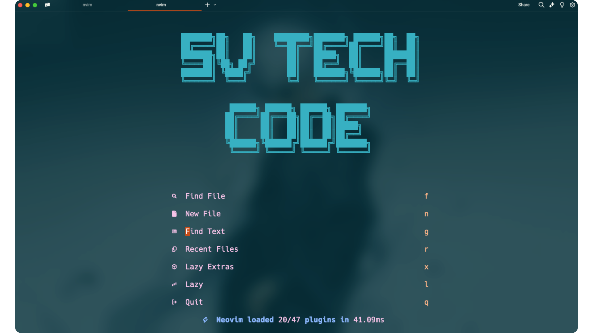
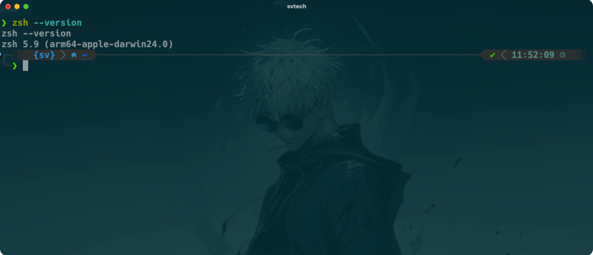

# .dotfiles

A continuación, encotrarás mi *.dotfiles* con las configuraciones de mi entorno de trabajo.

## Nvim whit LazyVim



Neovim es un editor de texto de código abierto basado en vim, con el cual, tienes la total libertad de personalizarlo a medida.
[web oficial](https://neovim.io)

Por otro laso LazyVim es una configuración personalizada de Neovim, con el cual, puedes transformarlo en un verdadero IDE.
[web oficial](https://www.lazyvim.org)

## Requerimientos generales

- Neovim >= 0.9.0
- Git >= 2.19.0
- Fuente [nerd-font](https://www.nerdfonts.com)

**Nota**: Si utilizas MacOS y tienes instalado [brew](https://brew.sh), puedes utilizar los siguientes comando para instalar la fuente nerd-font desde la terminal.

```
brew tap homebrew/cask-fonts
brew install --cask font-hack-nerd-font
```

## ZSH whit oh-my-zsh


ZSH es un interprete de comandos de UNIX, fácil de utilizr y configurar mediante complementos como oh-my-zsh.
[repositorio](https://github.com/ohmyzsh/ohmyzsh/wiki/Installing-ZSH)

Por otro lado oh-my-zsh es un complemento que permite gestionar y mejorar la configuración tanto funcional como visual de ZSH.
[web oficial](https://ohmyz.sh)

## Terminales recomendadas

- [Warp](https://www.warp.dev)
- [Iterm2](https://iterm2.com)
- [Kitty](https://sw.kovidgoyal.net/kitty/binary/)
- [Alacritty](https://alacritty.org)
