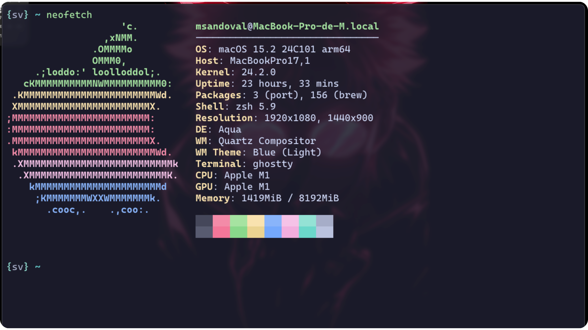

# Ghostty
El nuevo emulador de terminal rápido, sencillo que utiliza una interfaz de usuario nativa de la plataforma junto con la aceleración de GPU.
Este es mi nuevo emulador de terminal favorito, el cual, instalado, configurado y personalizado a gusto, permitiendo obtener un entorno de trabajo agradable y fluido.

<div align="center">
  <a href="https://www.linkedin.com/in/mario-sandoval-luengo-a059051b6" target="_blank" >
    </a>
  &nbsp;
  <a href="https://www.instagram.com/svtech_code/" target="_blank" >
    </a>
  &nbsp;
  <a href="https://x.com/svtech_code" target="_blank" >
    </a>
</div>



## ⚙️ Instalación
La instalación de ghostty, puedes realizarla directamente desde su [web oficial](https://ghostty.org/download), tanto para Linux como para MacOS.
En mi caso, al tener instalado [Homebrew](https://brew.sh), lo instalo desde la terminal con el siguiente comando:
```
brew install --cask ghostty
```
De esta manera se instala como aplicación en nuestro entorno de MacOs.

</br>

## 📂 Preparación
Ahora, tenemos que preparar nuestro entorno para comenzar con la configuración y personalización de ghostty, partiendo por la creación de la carpeta que contendrá al archivo de configuración, en mi caso, dentro del directorio ```~/.config```, de la siguiente forma:
```
mkdir ~/.config/ghostty
```

- Clonación del repositorio para usar las configuraciones presentadas:
```
https://github.com/svtech-code/.dotfiles.git
```

Luego de crear la carpeta y haber clonado el repositorio, puedes usar cualquiera de las siguientes opciones:
- Copiar configuración proporcionada a tu carpeta de ghostty:
```
cp .dotfiles/ghostty/config ~/.config/ghostty/
```

- Hacer un enlace simbólico desde la carpeta clonada a tu carpeta ghostty:
```
ln -s ~/.dotfiles/ghostty ~/.config/ghostty
```

- Crear tu propio archivo de configuración para una configuración personalizada:
```
touch ~/.config/ghostty/confg
```
**Nota**: El archivo de configuración de ghostty, no tiene ningun tipo de extensión

</br>

## Fuentes de interes
- 📚 [Documentación](https://ghostty.org/docs)
- 🎨 [Personalización interactiva](https://ghostty.zerebos.com)

</br>

## 👨‍💻 Comandos básicos
Los siguientes comandos de la terminal, permiten visualizar información de utilidad para ghostty, como por ejemplo:
- ghostty +list-themes: Muestra la lista de themas soportados por ghostty.
- ghostty +show-config: Muestra la configuración actual de ghsotty.
- ghostty +list-keybinds: Muestra los atajos de teclado.
- ghostty +list-actions: Muestra las acciones permitidas y soportadas.
- ghostty +list-fonts: Muestra las fuentes aplicadas.
- ghostty +list-colors: Muestra la lista de colores.

</br>

## 🛠️ Atajos de teclado
Algunos de los comandos básicos de ghostty, son:
|     |Comando            | Acción                                        |
| :-- | :---------------  | :-------------------------------------------- |
| ⌨️ | cmd + ,            | Abrir archivo de configuración                |
| ⌨️ | cmd + shift + ,    | Recargar la configuración                     |
| ⌨️ | cmd + d            | Crear un split vertical                       |
| ⌨️ | cmd + shift + d    | Crear un split horizontal                     |
| ⌨️ | cmd + alt + ↑ / ↓  | Moverse entre split de manera vertical        |
| ⌨️ | cmd + alt + ← / →  | Moverse entre split de manera horizontal      |


